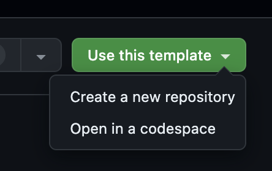

# Portmyfolio Boilerplate

Click on `Use this template` -> `Create a new repository` in the top right corner to copy the Portmyfolio Boilerplate in your github account.



## Development

Install the `portmyfolio` package globally

```bash
npm i -g portmyfolio
```

Run the following command at the root of your directory where the `port.json` is. It will start the development server

```bash
portmyfolio dev
```

For more info about the package visit the official [documentation](https://docs.portmyfolio.com/development#portmyfolio-cli).

## Deployment

You can deploy the template on any platform like **Vercel**, **Netlify**, etc. You need to do the following -

1. Select _Next.js_ as the selected framework
2. Change the build command to `npm run build`
3. Set the output directory to `.port`

**And all set! You are good to go 🚀**
